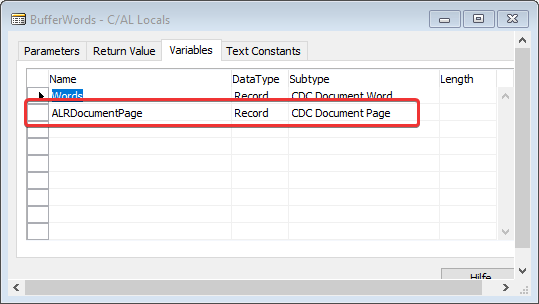

## Important notice ##
Please choose allways the latest release/version of the advanced line recognition if possible.

Currently we will <ins>not add new functionality into BC14 and older</ins> version but maintain the existing ones to be compatible with new versions of Document Capture.


If you cannot find an object set with the correct combination of your desired Document Capture and Business Central/NAV version, you have to downgrade/merge it **by yourself** or with the help of your partner.
Usually you can allways try to e.g. compile against an older BC application and DC version as the ALR doesn't have too many dependencies to the standard DC objects.

## Old(er) NAV and Document Capture Versions ##
If you need to implement the Advanced Line Recognition for older NAV or DC Versions <ins>without Event options (NAV2015 and older)</ins> you have to make minor modifications to the application.

1. Codeunit 6085575
* First of all you have to add a new global function SetLineRegion() 


* Add global variables


* Add local variable ALRDocumentPage to function BufferWords



* Add/Modify CAL Code in function BufferWords


```
//<ALR>
IF (LineRegionFromPage > 0) OR (LineRegionToPage > 0) THEN BEGIN
  ALRDocumentPage.SETRANGE("Document No.",DocumentNo);
  ALRDocumentPage.SETRANGE("Page No.",LineRegionFromPage,LineRegionToPage);
  IF ALRDocumentPage.FINDSET THEN
    REPEAT
      IF LineRegionToPos = 0 THEN
        Words.SETFILTER(Top,STRSUBSTNO('%1..%2',LineRegionFromPos,ALRDocumentPage."Bottom Word Pos."))
      ELSE
        Words.SETFILTER(Top,DELCHR(STRSUBSTNO('%1..%2',LineRegionFromPos,LineRegionToPos),'=',' '));

      IF Words.FINDSET(FALSE,FALSE) THEN
        REPEAT
          GlobalWords := Words;
          GlobalWords.INSERT;
        UNTIL Words.NEXT = 0;
    UNTIL ALRDocumentPage.NEXT = 0;
END ELSE BEGIN
//</ALR>
IF PageNo <> 0 THEN
  Words.SETRANGE("Page No.",PageNo);
IF Words.FINDSET(FALSE,FALSE) THEN
  REPEAT
    GlobalWords := Words;
    GlobalWords.INSERT;
  UNTIL Words.NEXT = 0;
//<ALR>
END;
//</ALR>
```

2. Codeunit 61001
* change the Object ID of variable LineManagementSI to 6085575


