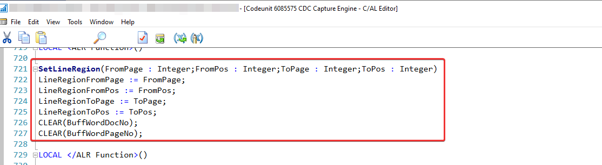
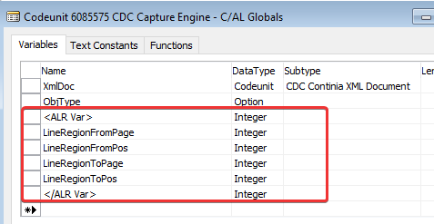
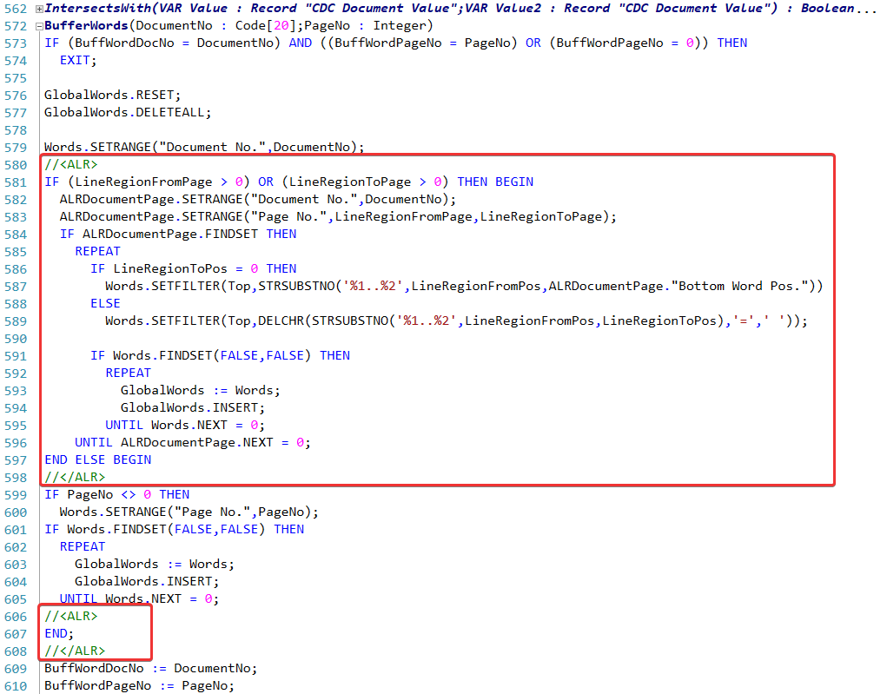
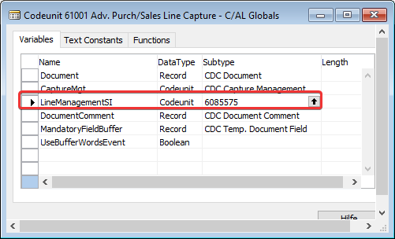

## Important notice ##
Please choose allways the latest release/version of the advanced line recognition.

If you cannot find an object set with the correct combination of your desired Document Capture and Business Central/NAV version, you have to downgrade/merge it **by yourself** or with the help of your partner.

## Old(er) NAV and Document Capture Versions ##
If you need to implement the Advanced Line Recognition for older NAV or DC Versions you have to make minor modifications to the application.

1. Codeunit 6085575
* First of all you have to add a new global function SetLineRegion() 

* Add global variables

* Add/Modify CAL Code in function BufferWords

2. Codeunit 61001
* change the Object ID of variable LineManagementSI to 6085575

